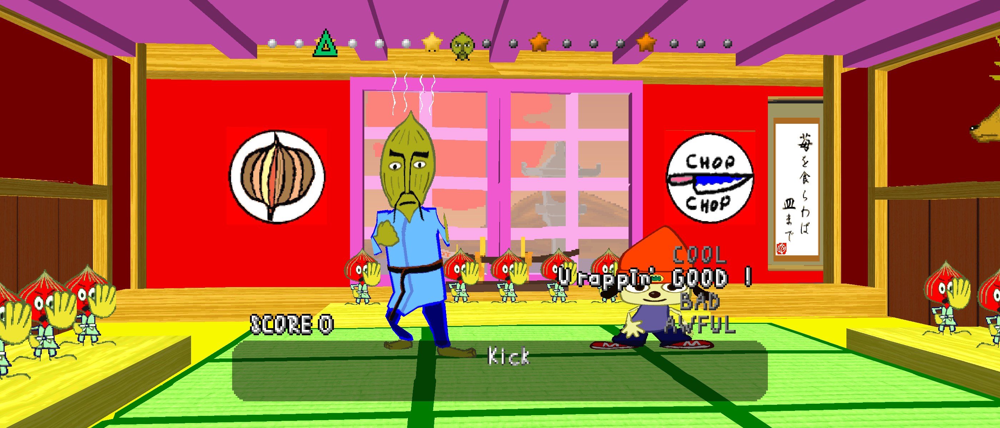

# PaRappaTheRapper Recompiled

<!-- retcomm-readme-metrics -->
[](https://github.com/mstan/PaRappaTheRapperRecomp/releases)
[](https://github.com/mstan/PaRappaTheRapperRecomp/releases/latest)
[](https://github.com/mstan/PaRappaTheRapperRecomp/releases/latest)
<!-- /retcomm-readme-metrics -->

<!-- retcomm-readme-boxart -->
<p align="center">
  
</p>
<!-- /retcomm-readme-boxart -->

Static recompilation of **PaRappaTheRapper** built on
[psxrecomp](https://github.com/mstan/psxrecomp) and
[recomp-ui](https://github.com/RetroPortingToolKit/recomp-ui).

Includes an optional Rhythm Timing Assist mod with configurable latency
compensation and early/late tolerance for controller and keyboard play.
Enable it in **Mods > Rhythm Timing Assist**. It starts disabled in a fresh
installation. Start with compensation at **0 ms** and adjust tolerance to
your setup; set both early and late tolerance to **60 ms** for maximum
forgiveness. Correct buttons and musical patterns still matter.
The audio-buffer target starts at **60 ms**; timing compensation remains
adjustable for your controller, display and sound system.

**[Download Windows or Linux builds from this fork](https://github.com/mstan/PaRappaTheRapperRecomp/releases/latest).**
Configure your controller in **Controls**; PaRappa uses a digital pad with
D-pad directions and unbound analogue sticks.

The default internal-resolution preset is **1080p**. The experimental
**Widescreen** mod starts enabled at **21:9** and expands the 3D gameplay
view using the native wide renderer. In **Mods > Widescreen**, choose
21:9, 16:9, **Fit to window**, or original 4:3. Movies and 2D menus keep
their original proportions; disabling the mod restores the 4:3 default.
Existing graphics settings take precedence over the new resolution default;
select 1080p in the launcher when upgrading an existing installation.
Other stages still need player validation.



| | |
|---|---|
| Players | 1 |
| Region | USA |
| Publisher | Sony Computer Entertainment |
| Year | 1996 |

Scaffolded with the New Project Layout. See
`psxrecomp/docs/GAME_PROJECT_SETUP.md` for the full flow.

<!-- retcomm-readme-launcher -->
## Retro Launcher

You can run this title **standalone** (download the release zip, point it at
your disc, play), or manage installs, updates, and disc/BIOS wiring with
**[Retro Launcher](https://github.com/RetroPortingToolKit/Retro-Launcher)** —
the Retro Compilation Manager hub for self-compiling recomps.

[Downloads](https://github.com/RetroPortingToolKit/Retro-Launcher/releases) ·
[Full README & features](https://github.com/RetroPortingToolKit/Retro-Launcher#readme)

<p align="center">
  
</p>

<p align="center">
  
</p>

Retro checks for updates, installs the prebuilt release zips, and automates
BIOS/ROM/save plumbing so you are not stuck repeating each game’s first run by hand.
<!-- /retcomm-readme-launcher -->

## Legal

You must own the original game. Disc images under `disc/` are gitignored and
must never be committed. Retail BIOS dumps are not redistributed and no C
derived from one may be committed; releases run on the bundled MIT OpenBIOS.

`generated/` (the recompiled game C) **is committed**: releases ship the
compiled game, built by CI from that tree. Regenerate and commit it whenever
seeds or the framework pin change.

Default app icon: `assets/psxrecomp.ico` (and `.png` / `.svg`) — Retro-themed controller mark from `psxrecomp/assets/`. Windows builds embed it via `APP_ICON`.

Optional box art under `launcher_assets/img/` may come from
[libretro-thumbnails](https://github.com/libretro-thumbnails/libretro-thumbnails)
(`Named_Boxarts`); see `BOXART_SOURCE.txt` when present.

## Quick start (dev)

```bash
git submodule update --init --recursive
./psxrecomp/tools/ci/build_emitters.sh
python3 psxrecomp/psxrecomp_cli.py generate \
  --config game.toml --project-root . --disc disc/<your>.cue
git add generated && git commit -m "Regenerate game C"
cmake -S . -B build-release -G Ninja -DCMAKE_BUILD_TYPE=Release
cmake --build build-release --target psx-runtime
```

Releases: tag `vX.Y.Z` (or run the *Release builds* workflow). CI builds the
committed `generated/` C on Linux and Windows and attaches
`prtr-<version>-<platform>.zip`, the compiled game. Locally:
`scripts/package_release.sh build-release linux-x64`.

## Local rhythm timing experiment

This fork combines the rhythm assist and digital-pad contribution with the
21:9/1080p display contribution. The timing work began on the isolated
`timing-lab` branch of `kirby1237/PaRappaTheRapperRecomp`, based on
`81faa9fe2e8bb64cac6cc272df04335f9df2dfc1`.
It does not use the owner's separate PaRappa recomp code, settings or saves.
Only the retail disc data was copied into this checkout's ignored `disc/` folder;
its MD5 matches upstream's supported USA image. The framework is pinned to
`0e9845a07b817082a493ed1be2c2bb19bae896c9`, which adds the three-line audio
configuration fix to upstream's original framework pin. No other framework
changes or code from the owner's separate recomp are included.

An experimental, default-off **Rhythm Timing Assist** package adds three
controls: latency compensation, extra early tolerance, and extra late tolerance.
Positive compensation judges a press earlier. Music, animation, controller
polling and the song clock keep their stock timing. Scripted playback is excluded.
The game's button mapping, scoring, turn checks and progression remain in charge.

The local build includes recomp-ui and opens its launcher by default.
Launch it from PowerShell at the project root:

```powershell
.\tools\launch_timing.ps1
.\tools\launch_timing.ps1 -OffsetMs 50 -EarlyMs 10 -LateMs 15
.\tools\launch_timing.ps1 -Profile controller-headphones -OffsetMs 20
.\tools\launch_timing.ps1 -Profile keyboard-speakers
.\tools\launch_timing.ps1 -Stock -BufferMs 180
.\tools\launch_timing.ps1 -Direct
```

On first launch, the defaults are 10 ms of extra tolerance on each side, zero
latency compensation, and a 60 ms audio buffer. Ordinary launches preserve
selections and timing values saved in the Mods screen; explicit profile or
timing arguments apply those settings instead. `-Direct` skips the launcher.
Adjust compensation in 5 ms steps after
settling on your audio setup. The script changes only this package's selection
in the isolated build, uses a generated local disc config, and creates separate
memory cards under `build-timing/timing-saves`. Launch one copy at a time.
`-Stock` disables the mod; use `-BufferMs 180` as well to reproduce upstream's
default audio target. Named profiles retain the offset, early/late tolerance and
audio buffer independently; explicit arguments update that profile. Profiles
apply to any input device and audio output and do not change controller bindings
or switch the Windows playback device. Controller support comes from the stock
SDL input path. PaRappa locks controller mode to digital, including previously
saved Analog settings. New builds/releases use D-pad directions with the sticks
unbound; existing custom mappings are preserved. The recomp-ui build exposes the
manifest's controls in Mods / Accessibility.

Retail judgement is `0x80014614`. Input time is at stage context `+0x10`,
stock half-window at `+0x34`, and the song descriptor's `+0x15c` stores ticks
per minute. The musical grid has 96 ticks per beat and 24 ticks per timing cell.
`0x80014718` adds the early bias; `0x8001476c` compares the cell remainder
against the inclusive early-plus-late window. In Stage 1, tempo is 10,560 ticks
per minute (110 BPM), one tick is 5.682 ms, and the stock half-window is eight
ticks (45.45 ms). The 10 ms settings round to two additional ticks per side,
giving about 56.82 ms early and late. Each side is capped at the neighbouring
cell's midpoint: Stage 1's maximum is twelve ticks, about 68.18 ms. Large
entered tolerances therefore stop widening the window at that cap.

A guarded, semantically identical change commutes the two operands of one
`ADDU`. It sends this routine through the existing interpreter, where trusted
instruction hooks adjust only its local timing registers. Upstream generated C
is untouched. The separate three-line framework fix connects the already parsed
`[audio] buffer_ms` to the audio bridge, which upstream otherwise leaves at 180 ms.
Disabling the timing feature makes no patch or hook
active. Tracing is opt-in through `PARAPPA_TIMING_TRACE=<csv path>`.

Validation includes cold boot with OpenBIOS, Stage 1 entry, injected Triangle
presses, savestate save/load receipts, live stock/forgiving/one-sided/100 ms
offset probes, and a native test of 102,400 stock arithmetic cases, one-sided
boundaries, signed offsets, caps and guards. Live hook output is checked against
the decoded retail arithmetic. Local screenshots, per-press CSVs, configuration,
audio queue statistics and receipts are in ignored `analysis/replay/`.
The corrected 60 ms audio target was verified in a 1,530-frame Stage 1 probe;
the final sampled queue fill was 96.8 ms with zero reported underruns. The
target is configurable and is not a guarantee of end-to-end audio latency.
The launcher was also checked from cold boot with its controller/speakers profile.

The probe repeats Triangle at different phases; it is not an autoplay route or
a full-stage completion test. Replays have small launch/input-start differences,
so score differences are not a calibrated before/after difficulty measurement.
Other stages, end-of-line latency behaviour, recorded replay fidelity and actual
controller/display/audio delay still need human testing. The host's latency ring
does not measure physical screen scanout or speaker delay. Upstream's default
audio target is 180 ms; the initial run held around 160 ms of audio, substantially
more than Stage 1's stock judgement half-window.
For human validation, start with Stage 1 using your controller and speakers.
Check whether correct presses feel consistently early or late, and whether the
audio drops out. Close the game before changing settings. Positive `-OffsetMs`
values compensate for presses that arrive late; negative values move judgement
the other way. Change the offset in 5 ms steps and keep headphones in a separate
profile. The example offsets above illustrate the controls, not measured values
for your hardware. Large positive offsets preserve stock judgement near the
start of the song until the adjusted time is within the song's timing grid.

```powershell
# Build settings used locally (native tools; avoid MSYS path reinterpretation).
# The audio fix is included in the pinned submodule revision.
git submodule update --init --recursive
& 'C:\Program Files\CMake\bin\cmake.exe' -S . -B build-timing -G Ninja `
  -DCMAKE_BUILD_TYPE=Release -DCMAKE_C_COMPILER=C:/msys64/mingw64/bin/gcc.exe `
  -DCMAKE_CXX_COMPILER=C:/msys64/mingw64/bin/g++.exe `
  -DCMAKE_MAKE_PROGRAM=C:/msys64/mingw64/bin/ninja.exe `
  -DPSX_DEBUG_TOOLS=ON -DPSX_RECOMP_UI=ON -DRECOMP_UI_ENABLE_MODS=ON -DPSX_STATIC_RUNTIME=ON `
  -DSDL3_DIR=C:/msys64/mingw64/lib/cmake/SDL3 -DCMAKE_PREFIX_PATH=C:/msys64/mingw64
& 'C:\Program Files\CMake\bin\cmake.exe' --build build-timing --target psx-runtime parappa_timing_test -j 6
& 'C:\Program Files\CMake\bin\ctest.exe' --test-dir build-timing -R parappa_timing_test --output-on-failure
# Needs the local Stage 1 save in slot 1; that save is not distributed.
& 'C:\Users\Matthew\AppData\Local\Programs\Python\Python312\python.exe' tools/timing_replay.py
```

## Symbols

Progressive map: `symbols.toml` → `python3 tools/sync_symbols.py` →
`psx_symbols.h` (`PSX_FN_*`). See `psxrecomp/docs/SYMBOLS.md`.

## Framework pins

Submodule gitlinks (`psxrecomp`, optional `recomp-ui`, nested `recomp-net`)
are authoritative. `framework_pins.txt` is an optional scaffold snapshot;
release CI logs SHAs with `record_pins.sh` but builds whatever the gitlinks
resolve to. Bump submodules deliberately — do not float on `main`/`master`
in release CI.

<!-- retcomm-readme-raid -->
---

<p align="center">
  <sub><b>R.A.I.D. — Retro AI Development</b> · a Discord for AI-assisted retro reverse-engineering, decomp &amp; recomp</sub>
</p>

<p align="center">
  <a href="https://discord.gg/Ad9BwSzctP"></a>
</p>
<!-- /retcomm-readme-raid -->
